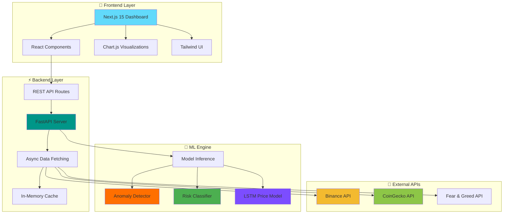
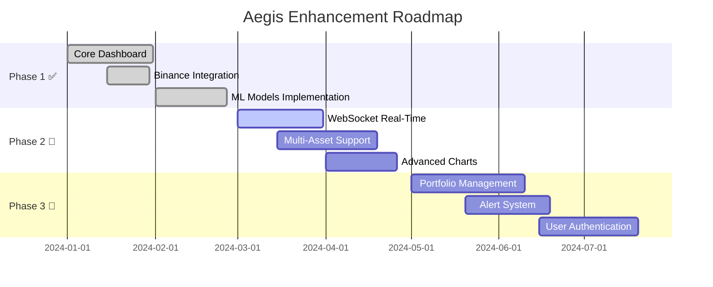

<div align="center">
  
</div>

<p align="center">
  
</p>

<p align="center">
  
  
  
  
  
  
</p>

<div align="center">
  
</div>

<br>

<!-- Animated Separator -->


<br>

##  **WHAT IS AEGIS?**

<div align="center">

### **Your AI-Powered Shield in Crypto Markets** 🛡️

<table>
<tr>
<td width="50%" valign="top">

### 🎯 **THE VISION**

```javascript
const aegis = {
    name: "Aegis Crypto Intelligence",
    tagline: "Trading-desk grade analytics",
    version: "3.0.0",
    
    mission: "Democratize institutional-grade crypto intelligence",
    
    dataFlow: {
        realtime: "Binance API → FastAPI → Next.js",
        marketData: "CoinGecko → Global Stats",
        sentiment: "Fear & Greed Index",
        predictions: "LSTM Model → 24H Forecasts"
    },
    
    aiEngine: {
        anomalyDetection: "Detect market irregularities",
        riskClassification: "Categorize risk levels",
        pricePrediction: "LSTM-based forecasting",
        explainableAI: "Transparent insights"
    },
    
    techStack: {
        frontend: "Next.js 15 + React 19 + Tailwind",
        backend: "FastAPI + Python 3.10+",
        ml: "TensorFlow + Scikit-Learn",
        visualization: "Chart.js + Recharts"
    }
};

console.log("From chaos to clarity ⚡");
```

</td>
<td width="50%" valign="top">

### 💎 **WHY AEGIS?**

<br>

> **"Data is the new oil,**  
> **but Intelligence is the refinery.**  
> **Aegis transforms raw market data**  
> **into actionable trading insights."**

<br>

**Key Differentiators:**

📡 **Real-Time Intelligence** → Live BTC/ETH tracking  
🤖 **Triple AI Engine** → Anomaly + Risk + LSTM  
🧠 **Explainable Predictions** → Understand the "why"  
📊 **Fear & Greed Index** → Market sentiment gauge  
📈 **Order Book Depth** → Terminal-style bid/ask view  
⚡ **Production Ready** → Built for scale  

<br>

**Built for Traders Who Demand More**  
Institutional insights, accessible to everyone.

</td>
</tr>
</table>

</div>

<br>

<!-- Animated Separator -->


<br>

##  **CORE FEATURES**

<div align="center">

### **🚀 FEATURE SHOWCASE**

<table>
<tr>
<td align="center" width="25%">
<br>
<strong>Real-Time Dashboard</strong><br>
<sub>Live BTC & ETH prices • 24h change tracking • High/Low monitoring • Volume analysis</sub>
</td>
<td align="center" width="25%">
<br>
<strong>Triple AI Engine</strong><br>
<sub>Anomaly detection • Risk classification • LSTM predictions • Confidence scoring</sub>
</td>
<td align="center" width="25%">
<br>
<strong>Order Book Terminal</strong><br>
<sub>Real-time BTC/USDT bids/asks • Spread analysis • Market depth • Volume tracking</sub>
</td>
<td align="center" width="25%">
<br>
<strong>Market Sentiment</strong><br>
<sub>Fear & Greed Index • Global market cap • BTC dominance • Market psychology</sub>
</td>
</tr>
</table>

<br>

### **📊 DASHBOARD COMPONENTS**

<table>
<tr>
<td width="50%" valign="top">

#### **Market Overview Cards**
- **BTC Card** → Price, 24h %, high/low, volume
- **ETH Card** → Price, 24h %, high/low, volume
- **Global Market Cap** → Total crypto market size
- **Fear & Greed Index** → 0-100 sentiment score

#### **Interactive Charts**
- **Multi-Timeframe Chart** → 1H, 4H, 24H, 7D, 1M
- **Auto-Refresh Mode** → Real-time updates
- **Chart.js Integration** → Smooth animations
- **Responsive Design** → Desktop & mobile ready

</td>
<td width="50%" valign="top">

#### **AI Insights Panel**
- **Momentum Analysis** → Bullish/Bearish/Neutral
- **Risk Assessment** → Low/Medium/High/Extreme
- **Trading Hints** → AI-generated recommendations
- **Market Drivers** → Key factors explanation

#### **ML Predictions**
- **24-Hour Price Range** → LSTM forecast
- **Confidence Intervals** → Statistical certainty
- **Trend Direction** → Up/Down/Sideways
- **Anomaly Alerts** → Unusual market behavior

</td>
</tr>
</table>

<br>

### **💡 INTELLIGENT INSIGHTS**


</div>

<br>

<!-- Animated Separator -->


<br>

##  **TECHNOLOGY STACK**

<div align="center">

### **🎨 FRONTEND POWERHOUSE**

<table>
<tr>
<td align="center" width="20%">

<br><strong>Next.js 15</strong>
</td>
<td align="center" width="20%">

<br><strong>React 19</strong>
</td>
<td align="center" width="20%">

<br><strong>Tailwind CSS</strong>
</td>
<td align="center" width="20%">

<br><strong>Chart.js</strong>
</td>
<td align="center" width="20%">

<br><strong>Recharts</strong>
</td>
</tr>
</table>


<br>

### **⚡ BACKEND ARCHITECTURE**

<table>
<tr>
<td align="center" width="25%">

<br><strong>FastAPI</strong>
</td>
<td align="center" width="25%">

<br><strong>Python 3.10+</strong>
</td>
<td align="center" width="25%">

<br><strong>HTTPX</strong>
</td>
<td align="center" width="25%">

<br><strong>Postman</strong>
</td>
</tr>
</table>


<br>

### **🤖 MACHINE LEARNING ENGINE**

<table>
<tr>
<td align="center" width="16.66%">

<br><strong>TensorFlow</strong>
</td>
<td align="center" width="16.66%">

<br><strong>Scikit-Learn</strong>
</td>
<td align="center" width="16.66%">

<br><strong>NumPy</strong>
</td>
<td align="center" width="16.66%">

<br><strong>Pandas</strong>
</td>
<td align="center" width="16.66%">

<br><strong>Keras</strong>
</td>
<td align="center" width="16.66%">

<br><strong>Matplotlib</strong>
</td>
</tr>
</table>


<br>

### **📡 DATA SOURCES**

<table>
<tr>
<td align="center" width="33.33%">

<br><strong>Binance API</strong><br>
<sub>Price Data • Order Book</sub>
</td>
<td align="center" width="33.33%">

<br><strong>CoinGecko API</strong><br>
<sub>Market Cap • Dominance</sub>
</td>
<td align="center" width="33.33%">

<br><strong>Alternative.me</strong><br>
<sub>Fear & Greed Index</sub>
</td>
</tr>
</table>

</div>

<br>

<!-- Animated Separator -->


<br>

##  **GETTING STARTED**

<div align="center">

### **🚀 LAUNCH IN 2 SIMPLE STEPS**

<table>
<tr>
<td align="center" width="50%">
<br>
<strong>STEP 1: Backend (FastAPI)</strong><br>
<sub>Python 3.10+ • ML Models • API Server</sub>
</td>
<td align="center" width="50%">
<br>
<strong>STEP 2: Frontend (Next.js)</strong><br>
<sub>Node.js 18+ • React 19 • Dashboard UI</sub>
</td>
</tr>
</table>

</div>

<br>

### **📋 PREREQUISITES**

```bash
# Required tools
✓ Node.js 18 or higher (for Next.js client)
✓ Python 3.10 or higher (for FastAPI backend)

# NOT Required (simplified architecture)
✗ Docker
✗ TimescaleDB
✗ Redis
```

<br>

### **⚡ BACKEND SETUP (FastAPI)**

```bash
# Navigate to server directory
cd server

# Create virtual environment
python -m venv venv

# Activate virtual environment
# Windows:
.\venv\Scripts\activate
# macOS/Linux:
source venv/bin/activate

# Install all dependencies
pip install -r requirements.txt

# Launch the API server
uvicorn app:app --reload --host 0.0.0.0 --port 8000

# 🎉 Backend running at http://localhost:8000
# 📚 API docs available at http://localhost:8000/docs
```

**What You Get:**
- FastAPI server with async IO
- ML engine with pre-trained models (`anomaly_detector.pkl`, `risk_classifier.pkl`, `btc_model.h5`)
- Real-time data fetching from Binance, CoinGecko, Alternative.me
- In-memory caching for performance
- Auto-generated interactive API documentation

<br>

### **🎨 FRONTEND SETUP (Next.js)**

```bash
# Navigate to client directory
cd client

# Install all dependencies
npm install
# or if you use yarn
yarn install

# Start the development server
npm run dev
# or
yarn dev

# 🎉 Dashboard running at http://localhost:3000
```

**What You Get:**
- Next.js 15 App Router with React Server Components
- Trading-desk grade UI with Tailwind CSS
- Real-time chart updates with Chart.js
- Responsive design for all devices
- Lucide icon system

<br>

### **🔗 CONNECTING FRONTEND TO BACKEND**

The dashboard automatically connects to `http://localhost:8000/api/v1` (configured in `client/src/app/page.tsx` as `API_BASE`).

**Make sure:**
1. ✅ Backend is running on port **8000**
2. ✅ Frontend is running on port **3000**
3. ✅ No CORS issues (FastAPI CORS middleware is pre-configured)

<br>

<!-- Animated Separator -->


<br>

##  **SYSTEM ARCHITECTURE**

<div align="center">



<br>

### **🔄 DATA FLOW PIPELINE**

```
┌─────────────────────────────────────────────────────────────────┐
│                        USER BROWSER                             │
│                   http://localhost:3000                         │
└────────────────────────┬────────────────────────────────────────┘
                         │
                         ▼
┌─────────────────────────────────────────────────────────────────┐
│                    NEXT.JS FRONTEND                             │
│  • Market Overview Cards    • AI Insights Panel                 │
│  • Interactive Charts       • Order Book View                   │
│  • Fear & Greed Display     • Prediction Widgets                │
└────────────────────────┬────────────────────────────────────────┘
                         │
                         │ REST API Calls
                         │ (fetch from http://localhost:8000)
                         ▼
┌─────────────────────────────────────────────────────────────────┐
│                   FASTAPI BACKEND                               │
│  Endpoints:                                                     │
│  • /api/v1/market/overview      → BTC/ETH + Market Data        │
│  • /api/v1/chart/btc-usdt       → Price Series                 │
│  • /api/v1/orderbook/btc-usdt   → Bid/Ask Data                │
│  • /api/v1/ai/insights          → ML Insights                  │
│  • /api/v1/predictions/24h      → LSTM Forecast                │
└────┬──────────────┬──────────────┬──────────────┬───────────────┘
     │              │              │              │
     ▼              ▼              ▼              ▼
┌──────────┐  ┌──────────┐  ┌──────────┐  ┌──────────────┐
│ Binance  │  │CoinGecko │  │Fear/Greed│  │  ML Engine   │
│   API    │  │   API    │  │   API    │  │ (TF + SK)    │
│          │  │          │  │          │  │              │
│• Prices  │  │• Market  │  │• Sentiment│  │• Anomaly     │
│• Volume  │  │  Cap     │  │  Index   │  │• Risk        │
│• Orders  │  │• Dominance│  │ (0-100)  │  │• LSTM Pred   │
└──────────┘  └──────────┘  └──────────┘  └──────────────┘
```

</div>

<br>

<!-- Animated Separator -->


<br>

##  **API ENDPOINTS**

<div align="center">

### **📡 AVAILABLE ROUTES**

<table>
<tr>
<th width="25%">Endpoint</th>
<th width="10%">Method</th>
<th width="65%">Description</th>
</tr>
<tr>
<td><code>/</code></td>
<td></td>
<td>Health check and basic API info</td>
</tr>
<tr>
<td><code>/api/v1/market/overview</code></td>
<td></td>
<td>BTC/ETH snapshot + global market cap + BTC dominance + Fear & Greed Index</td>
</tr>
<tr>
<td><code>/api/v1/chart/btc-usdt</code></td>
<td></td>
<td>BTC price series with multiple timeframes (1H, 4H, 24H, 7D, 1M)</td>
</tr>
<tr>
<td><code>/api/v1/orderbook/btc-usdt</code></td>
<td></td>
<td>Real-time order book: top bids/asks + spread analysis</td>
</tr>
<tr>
<td><code>/api/v1/ai/insights</code></td>
<td></td>
<td>ML-generated market insights & recommendations (cached)</td>
</tr>
<tr>
<td><code>/api/v1/predictions/24h</code></td>
<td></td>
<td>LSTM model 24-hour price range prediction + confidence score</td>
</tr>
</table>

<br>

### **📊 QUERY PARAMETERS**

**Chart Endpoint** (`/api/v1/chart/btc-usdt`)
```
?timeframe=24H    # Options: 1H, 4H, 24H, 7D, 1M
```

<br>

### **📝 EXAMPLE RESPONSES**

<details>
<summary><b>🔍 Market Overview Response (Click to expand)</b></summary>

```json
{
  "btc": {
    "price": 67234.56,
    "change_24h": 2.34,
    "high_24h": 68500.00,
    "low_24h": 66100.00,
    "volume_24h": 28456789123
  },
  "eth": {
    "price": 3542.89,
    "change_24h": 1.87,
    "high_24h": 3600.00,
    "low_24h": 3480.00,
    "volume_24h": 15678901234
  },
  "global": {
    "total_market_cap": 2456789012345,
    "btc_dominance": 54.3,
    "fear_greed_index": 68,
    "fear_greed_classification": "Greed"
  }
}
```

</details>

<details>
<summary><b>📈 LSTM Prediction Response (Click to expand)</b></summary>

```json
{
  "prediction": {
    "price_range": {
      "low": 66500,
      "high": 69800
    },
    "confidence": 0.87,
    "trend": "BULLISH",
    "model": "LSTM",
    "timestamp": "2024-02-10T14:30:00Z"
  }
}
```

</details>

<details>
<summary><b>🤖 AI Insights Response (Click to expand)</b></summary>

```json
{
  "insights": {
    "momentum": "BULLISH",
    "risk_level": "MEDIUM",
    "anomaly_detected": false,
    "recommendations": [
      "Strong buying pressure detected",
      "Volume confirms upward momentum",
      "Consider profit-taking near resistance"
    ],
    "market_drivers": [
      "Positive sentiment (Fear & Greed: 68)",
      "Increasing institutional interest",
      "Technical breakout confirmed"
    ]
  }
}
```

</details>

<br>


**📚 Full Interactive API Documentation:** `http://localhost:8000/docs`

</div>

<br>

<!-- Animated Separator -->


<br>

##  **PROJECT STRUCTURE**

```
aegis/
│
├── 📁 client/                              # Next.js 15 Frontend
│   ├── 📁 src/
│   │   └── 📁 app/                         # App Router (Next.js 15)
│   │       ├── page.tsx                   # Main dashboard page
│   │       ├── layout.tsx                 # Root layout
│   │       └── globals.css                # Global styles
│   │
│   ├── 📁 components/                      # React Components
│   │   ├── Dashboard.tsx                  # Main dashboard component
│   │   ├── MarketCard.tsx                 # BTC/ETH/Market cards
│   │   ├── ChartModule.tsx                # Chart.js price chart
│   │   ├── OrderBook.tsx                  # Order book display
│   │   ├── AIInsights.tsx                 # AI insights panel
│   │   └── FearGreedIndex.tsx             # Sentiment indicator
│   │
│   ├── 📁 lib/                             # Utilities
│   │   ├── api.ts                         # API client functions
│   │   └── utils.ts                       # Helper functions
│   │
│   ├── 📄 package.json                    # Frontend dependencies
│   ├── 📄 next.config.js                  # Next.js configuration
│   └── 📄 tailwind.config.js              # Tailwind configuration
│
├── 📁 server/                              # FastAPI Backend
│   ├── 📄 app.py                          # FastAPI application entry
│   │
│   ├── 📁 app/
│   │   ├── 📁 api/                        # API route handlers
│   │   │   ├── market.py                 # /api/v1/market/*
│   │   │   ├── chart.py                  # /api/v1/chart/*
│   │   │   ├── orderbook.py              # /api/v1/orderbook/*
│   │   │   ├── insights.py               # /api/v1/ai/insights
│   │   │   └── predictions.py            # /api/v1/predictions/*
│   │   │
│   │   ├── 📁 ml/                         # Machine Learning Engine
│   │   │   └── engine.py                 # ML model orchestration
│   │   │
│   │   ├── 📁 models/                     # Pre-trained ML Models
│   │   │   ├── anomaly_detector.pkl      # Anomaly detection model
│   │   │   ├── risk_classifier.pkl       # Risk classification model
│   │   │   └── btc_model.h5              # LSTM price prediction model
│   │   │
│   │   ├── 📁 services/                   # External API integrations
│   │   │   ├── binance.py                # Binance API client
│   │   │   ├── coingecko.py              # CoinGecko API client
│   │   │   └── fear_greed.py             # Fear & Greed API client
│   │   │
│   │   └── 📁 utils/                      # Helper functions
│   │       ├── cache.py                  # In-memory caching
│   │       └── helpers.py                # Utility functions
│   │
│   └── 📄 requirements.txt                # Python dependencies
│
├── 📁 data/                                # Data storage (optional)
│   ├── historical/                        # Historical price data
│   └── predictions/                       # Prediction logs
│
├── 📁 notebooks/                           # Jupyter notebooks (optional)
│   ├── data_analysis.ipynb               # Exploratory analysis
│   └── model_training.ipynb              # ML model training
│
├── 📄 README.md                            # This file! 👋
└── 📄 .gitignore                           # Git ignore rules
```

<br>

<!-- Animated Separator -->


<br>

##  **ML MODELS DEEP DIVE**

<div align="center">

<table>
<tr>
<td width="33.33%" valign="top">

### **🔍 ANOMALY DETECTOR**

**Model:** `anomaly_detector.pkl`  
**Type:** Isolation Forest / One-Class SVM

**Purpose:**
- Detect unusual market behavior
- Identify price/volume anomalies
- Flag potential market manipulation
- Alert on irregular patterns

**Features Used:**
- Price volatility
- Volume spikes
- Order book imbalance
- Historical deviation

**Output:**
- `True` → Anomaly detected
- `False` → Normal behavior
- Anomaly score (0-1)

</td>
<td width="33.33%" valign="top">

### **⚠️ RISK CLASSIFIER**

**Model:** `risk_classifier.pkl`  
**Type:** Random Forest Classifier

**Purpose:**
- Categorize market risk levels
- Assess trading conditions
- Guide position sizing
- Risk-adjusted recommendations

**Risk Levels:**
- 🟢 **LOW** → Stable market
- 🟡 **MEDIUM** → Moderate volatility
- 🟠 **HIGH** → Elevated risk
- 🔴 **EXTREME** → Dangerous conditions

**Features Used:**
- Volatility metrics
- Volume patterns
- Sentiment indicators
- Technical signals

</td>
<td width="33.33%" valign="top">

### **📈 LSTM PRICE MODEL**

**Model:** `btc_model.h5`  
**Type:** LSTM Neural Network

**Architecture:**
```python
Sequential Model:
├── LSTM (128 units)
├── Dropout (0.2)
├── LSTM (64 units)
├── Dropout (0.2)
├── Dense (32 units)
└── Output (1 unit)
```

**Purpose:**
- 24-hour price forecasting
- Trend prediction
- Confidence intervals
- Range estimation

**Output:**
- Price range (low-high)
- Confidence score
- Trend direction

</td>
</tr>
</table>

<br>

### **🎯 MODEL ORCHESTRATION**

```python
# Simplified ML Engine Flow (server/app/ml/engine.py)

class MLEngine:
    def __init__(self):
        self.anomaly_detector = load_model('anomaly_detector.pkl')
        self.risk_classifier = load_model('risk_classifier.pkl')
        self.lstm_model = load_model('btc_model.h5')
    
    def analyze_market(self, market_data):
        # Step 1: Anomaly Detection
        anomaly = self.anomaly_detector.predict(market_data)
        
        # Step 2: Risk Classification
        risk_level = self.risk_classifier.predict(market_data)
        
        # Step 3: Price Prediction
        prediction = self.lstm_model.predict(market_data)
        
        return {
            'anomaly_detected': anomaly,
            'risk_level': risk_level,
            'price_prediction': prediction
        }
```

</div>

<br>

<!-- Animated Separator -->


<br>

##  **DASHBOARD FEATURES**

<div align="center">

### **🎨 USER INTERFACE COMPONENTS**

<table>
<tr>
<td width="50%" valign="top">

#### **Hero Panel**
- **Aegis Branding** → Professional header
- **Live Indicator** → Real-time vs. fallback status
- **Last Updated** → Timestamp of latest data
- **System Status** → Backend health check

#### **Market Overview Cards**
- **BTC Card**
  - Current price
  - 24h percentage change
  - 24h high/low range
  - 24h trading volume
  
- **ETH Card**
  - Current price
  - 24h percentage change
  - 24h high/low range
  - 24h trading volume

- **Global Market Cap**
  - Total crypto market capitalization
  - 24h change percentage
  - Visual trend indicator

- **Fear & Greed Index**
  - Sentiment score (0-100)
  - Classification (Fear/Greed)
  - Color-coded visualization

</td>
<td width="50%" valign="top">

#### **BTC Chart Module**
- **Multi-Timeframe Support**
  - 1 Hour (1H)
  - 4 Hours (4H)
  - 24 Hours (24H)
  - 7 Days (7D)
  - 1 Month (1M)
  
- **Chart Features**
  - Smooth animations (Chart.js)
  - Auto-refresh mode
  - Responsive scaling
  - Interactive tooltips
  - Volume overlays

#### **Order Book Terminal**
- **Bids Table** → Top 10 buy orders
- **Asks Table** → Top 10 sell orders
- **Spread Analysis** → Bid-ask spread %
- **Depth Visualization** → Cumulative volume
- **Real-time Updates** → Live order flow

#### **AI Insights Panel**
- **Momentum Indicator** → Bullish/Bearish/Neutral
- **Risk Assessment** → Current risk level
- **Trading Hints** → AI-generated suggestions
- **Market Drivers** → Key factors breakdown
- **Explainable AI** → Transparent reasoning

</td>
</tr>
</table>

</div>

<br>

<!-- Animated Separator -->


<br>

##  **ROADMAP & FUTURE ENHANCEMENTS**

<div align="center">

### **🎯 PLANNED FEATURES**

<table>
<tr>
<td align="center" width="25%">
<br>
<strong>Advanced ML Models</strong><br>
<sub>Transformer • GRU • Ensemble</sub>
</td>
<td align="center" width="25%">
<br>
<strong>Multi-Asset Support</strong><br>
<sub>Top 50 Cryptocurrencies</sub>
</td>
<td align="center" width="25%">
<br>
<strong>Portfolio Tracking</strong><br>
<sub>P&L • Holdings • Analytics</sub>
</td>
<td align="center" width="25%">
<br>
<strong>Smart Alerts</strong><br>
<sub>Price • Anomaly • Risk Alerts</sub>
</td>
</tr>
</table>

<br>

### **🔮 UPCOMING INTEGRATIONS**


<br>

### **📊 DEVELOPMENT PHASES**



</div>

<br>

<!-- Animated Separator -->


<br>

##  **NOTES & BEST PRACTICES**

<div align="center">

### **⚡ PERFORMANCE OPTIMIZATIONS**

<table>
<tr>
<td width="50%" valign="top">

#### **Backend Optimizations**
- ✅ Async IO for concurrent requests
- ✅ In-memory caching for frequent queries
- ✅ Graceful fallback to sample data
- ✅ Efficient model loading
- ✅ Request timeout handling
- ✅ Rate limiting ready

</td>
<td width="50%" valign="top">

#### **Frontend Optimizations**
- ✅ React Server Components (RSC)
- ✅ Next.js automatic code splitting
- ✅ Image optimization
- ✅ Lazy loading components
- ✅ Debounced API calls
- ✅ Memoized expensive calculations

</td>
</tr>
</table>

<br>

### **🛡️ PRODUCTION READINESS**

**Current Status:**
- ✅ Clean separation of concerns
- ✅ Error handling & fallbacks
- ✅ API documentation (Swagger)
- ✅ Responsive UI design
- ✅ TypeScript type safety (frontend)
- ✅ Async/await patterns

**Next Steps for Production:**
- 🔄 Add environment-based configuration
- 🔄 Implement authentication & authorization
- 🔄 Set up reverse proxy (NGINX)
- 🔄 Add monitoring & logging
- 🔄 Implement rate limiting
- 🔄 Add end-to-end tests

</div>

<br>

<!-- Animated Separator -->


<br>

##  **TROUBLESHOOTING**

<details>
<summary><b>🔴 Common Issues & Solutions</b></summary>

<br>

### **Backend Issues**

**Problem:** `ModuleNotFoundError: No module named 'fastapi'`
```bash
# Solution: Ensure you're in the virtual environment
cd server
source venv/bin/activate  # or .\venv\Scripts\activate on Windows
pip install -r requirements.txt
```

**Problem:** `404 Not Found` on API endpoints
```bash
# Solution: Check if backend is running on port 8000
# Visit http://localhost:8000/docs to verify
```

**Problem:** External API rate limits
```bash
# Solution: The system automatically falls back to sample data
# Check console logs for "Using fallback data" messages
```

<br>

### **Frontend Issues**

**Problem:** `ECONNREFUSED` when connecting to backend
```bash
# Solution 1: Ensure backend is running first
cd server && uvicorn app:app --reload

# Solution 2: Check API_BASE URL in client/src/app/page.tsx
# Should be: http://localhost:8000
```

**Problem:** Charts not rendering
```bash
# Solution: Clear node_modules and reinstall
cd client
rm -rf node_modules
npm install
npm run dev
```

**Problem:** Tailwind styles not applying
```bash
# Solution: Rebuild Tailwind
npm run dev
# Or clear .next folder
rm -rf .next
npm run dev
```

<br>

### **ML Model Issues**

**Problem:** Model files not found
```bash
# Solution: Ensure model files are in server/app/models/
# Required files:
#   - anomaly_detector.pkl
#   - risk_classifier.pkl
#   - btc_model.h5
```

**Problem:** TensorFlow import errors
```bash
# Solution: Install specific TensorFlow version
pip install tensorflow==2.13.0
# Or use CPU-only version
pip install tensorflow-cpu==2.13.0
```

</details>

<br>

<!-- Animated Separator -->


<br>

##  **CONTRIBUTING**

<div align="center">

We welcome contributions! 🎉

### **🤝 HOW TO CONTRIBUTE**

<table>
<tr>
<td align="center" width="33.33%">
<br>
<strong>1. Fork & Clone</strong><br>
<sub>Fork the repository and clone locally</sub>
</td>
<td align="center" width="33.33%">
<br>
<strong>2. Create Branch</strong><br>
<sub>Make changes in a feature branch</sub>
</td>
<td align="center" width="33.33%">
<br>
<strong>3. Pull Request</strong><br>
<sub>Submit PR with clear description</sub>
</td>
</tr>
</table>

<br>

**Areas for Contribution:**
- 🤖 New ML models & algorithms
- 📊 Additional chart types & visualizations
- 🎨 UI/UX enhancements
- 📝 Documentation improvements
- 🐛 Bug fixes & optimizations
- 🧪 Test coverage expansion
- 🌐 Additional data source integrations

</div>

<br>

<!-- Animated Separator -->


<br>

##  **LICENSE & ACKNOWLEDGMENTS**

<div align="center">

### **📄 LICENSE**

This project is licensed under the **MIT License** - see the [LICENSE](LICENSE) file for details.

<br>

### **🙏 ACKNOWLEDGMENTS**

**Powered by Amazing Open Source:**
- [Next.js](https://nextjs.org/) - The React Framework for Production
- [FastAPI](https://fastapi.tiangolo.com/) - Modern, Fast Python API Framework
- [TensorFlow](https://www.tensorflow.org/) - End-to-End Machine Learning Platform
- [Scikit-learn](https://scikit-learn.org/) - Machine Learning in Python
- [Chart.js](https://www.chartjs.org/) - Simple yet Flexible JavaScript Charting
- [Tailwind CSS](https://tailwindcss.com/) - Utility-First CSS Framework

**Data Providers:**
- [Binance API](https://binance-docs.github.io/apidocs/) - Cryptocurrency Market Data
- [CoinGecko API](https://www.coingecko.com/api) - Global Crypto Market Stats
- [Alternative.me](https://alternative.me/crypto/fear-and-greed-index/) - Fear & Greed Index

**Special Thanks:**
- Open-source community for incredible tools
- Early testers and contributors
- ML researchers for model architectures

</div>

<br>

<!-- Animated Separator -->


<br>

<div align="center">
  
  
  
  ### 💫 **"Data is the new oil, but Intelligence is the refinery"**
  
  <sub>Built with 💜 by [Nimit Gupta](https://github.com/Nimit746) • Powered by AI & Real-Time Data • Trading smarter, not harder 📈</sub>
  
  <br><br>
  
  
  
  
  
  
  <br>
  
  **⭐ Star this repository if you find it helpful!**
  
  **🔔 Watch for updates on new features and ML models!**
  
  **🤝 Contributions are always welcome!**
  
</div>

<br>

<!-- Footer Animation -->
<div align="center">
  
</div>

<div align="center">
  <sub>Aegis - Your AI-Powered Shield in Crypto Markets • Institutional intelligence, accessible to all ⚡✨</sub>
</div>
